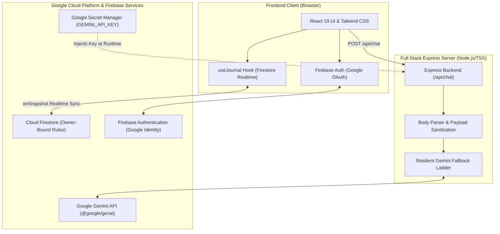
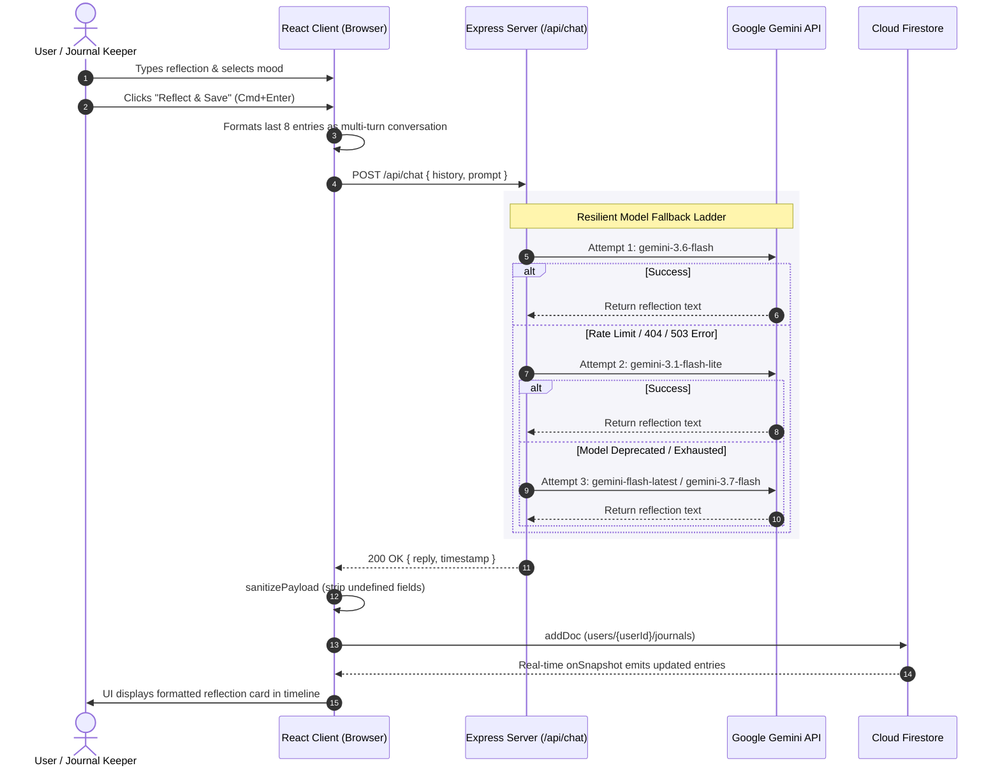

# Reflective AI Journal

A secure, production-grade, real-time AI-powered reflective journaling application built with **React 19**, **TypeScript**, **Express**, **Tailwind CSS**, **Google Cloud Firestore**, **Firebase Authentication**, and the **Gemini API** via `@google/genai`.

---

## 1. System Architecture & Flow Diagrams

### High-Level System Architecture



---

### End-to-End Journaling & Reflection Flow



---

## 2. Threat Summary Table (Agentic Threat Modeling)

| Threat Zone | Threat Scenario | Countermeasure Implemented |
| :--- | :--- | :--- |
| **Input Surfaces** | Malicious injection or oversized payload via `/api/chat` | Server enforces `express.json({ limit: '1mb' })`, defensive null-safe destructuring, and prompt string slicing. |
| **Planning & Reasoning** | Prompt injection attempting to break journal persona | Dedicated system instructions with grounded, empathetic boundaries and separation between conversational history and system prompt. |
| **Tool / Model Execution** | Gemini rate limits, outages, or model deprecations | Automated resilient fallback ladder (`gemini-3.6-flash` → `gemini-3.1-flash-lite` → `gemini-flash-latest` → `gemini-3.7-flash`). |
| **Memory & State** | Cross-user data leakage or unauthorized journal document tampering | Strict owner-bound Firestore security rules (`users/{userId}/journals/{journalId}` verifying `request.auth.uid == userId`) and payload undefined-stripping (`sanitizePayload`). |
| **Inter-System Communication** | Secret key leakage to browser client | Server-side proxy architecture where `GEMINI_API_KEY` is strictly kept on the Express backend (`server.ts`) and never exposed to the frontend. |

---

## 3. Project & Repository Structure

```
├── .env.example                     # Environment variables schema and documentation
├── firestore.rules                  # Security rules enforcing user data isolation
├── firebase-applet-config.json      # Provisioned Firebase configuration metadata
├── index.html                       # Application HTML entrypoint with typography fonts
├── metadata.json                    # Application metadata, capabilities, & permissions
├── package.json                     # NPM dependencies, build, and dev scripts
├── tsconfig.json                    # TypeScript strict compiler configuration
├── vite.config.ts                   # Vite bundler configuration with Tailwind plugin
├── server.ts                        # Express backend proxy with Gemini API fallback ladder
└── src/
    ├── main.tsx                     # React 19 application mount point
    ├── App.tsx                      # Main application view & state coordinator
    ├── firebase.ts                  # Firebase app, auth, & Firestore initialization
    ├── useJournal.ts                # Custom React hook for real-time Firestore sync & AI chat
    ├── types.ts                     # TypeScript shared interfaces (JournalEntry, MoodType)
    ├── vite-env.d.ts                # TypeScript Vite client types declarations
    ├── index.css                    # Tailwind CSS entrypoint
    └── components/
        ├── Header.tsx               # Brand header, realtime status, & Google Auth controls
        ├── AuthBanner.tsx           # Security overview & Google Sign-In call to action
        ├── JournalComposer.tsx      # Reflection input, mood selector, & inspirations
        ├── JournalEntryCard.tsx     # Markdown reflection renderer, copy, & delete actions
        ├── JournalFilter.tsx        # Real-time search query and mood filter bar
        └── JournalStats.tsx         # User statistics (word count, reflection streak, top mood)
```

---

## 4. Local Development & Testing Guide

Follow these steps to run and test the complete application locally:

### Step 1: Prerequisites
- **Node.js**: v20.x or higher (`node -v`)
- **NPM**: v10.x or higher (`npm -v`)
- **Google Cloud Gemini API Key**: [Get a key from Google AI Studio](https://aistudio.google.com/)

### Step 2: Clone and Install Dependencies
```bash
# Clone repository
git clone <repository-url>
cd reflective-ai-journal

# Install all required dependencies
npm install
```

### Step 3: Configure Local Environment
Create a `.env` file in the root directory:

```env
# Gemini API Key (Required for server-side reflection generation)
GEMINI_API_KEY=your_actual_gemini_api_key_here

# Firebase Client Configuration (Optional if using provisioned defaults)
VITE_FIREBASE_API_KEY=your_firebase_api_key
VITE_FIREBASE_AUTH_DOMAIN=your_project.firebaseapp.com
VITE_FIREBASE_PROJECT_ID=your_project_id
VITE_FIREBASE_STORAGE_BUCKET=your_project.firebasestorage.app
VITE_FIREBASE_MESSAGING_SENDER_ID=your_sender_id
VITE_FIREBASE_APP_ID=your_app_id
```

### Step 4: Run Development Server
```bash
npm run dev
```
The server starts at **`http://localhost:3000`** with Express backend routes (`/api/chat`, `/api/health`) and Vite frontend middleware active.

### Step 5: Verify Type Safety & Production Build
```bash
# Check TypeScript compilation without emitting files
npm run lint

# Build full-stack production bundle (Vite + esbuild CJS server)
npm run build

# Start the compiled production server
npm start
```

---

## 5. Google Cloud Secret Management (Zero-Hardcoding Hygiene)

Create and populate the `GEMINI_API_KEY` in Google Cloud Secret Manager:

```bash
# 1. Create the secret in Google Secret Manager
gcloud secrets create GEMINI_API_KEY --replication-policy="automatic"

# 2. Add the secret version with your Gemini API Key
echo -n "YOUR_GEMINI_API_KEY" | gcloud secrets versions add GEMINI_API_KEY --data-file=-

# 3. Grant the Cloud Run default service account permission to read the secret
PROJECT_NUMBER=$(gcloud projects describe $(gcloud config get-value project) --format='value(projectNumber)')
gcloud secrets add-iam-policy-binding GEMINI_API_KEY \
  --member="serviceAccount:${PROJECT_NUMBER}-compute@developer.gserviceaccount.com" \
  --role="roles/secretmanager.secretAccessor"
```

---

## 6. Firestore Database Security Configuration

Deploy owner-bound security rules to ensure user data isolation:

```javascript
rules_version = '2';
service cloud.firestore {
  match /databases/{database}/documents {
    match /users/{userId}/journals/{journalId} {
      allow read, write: if request.auth != null && request.auth.uid == userId;
    }
    match /users/{userId}/interactions/{interactionId} {
      allow read, write: if request.auth != null && request.auth.uid == userId;
    }
  }
}
```

---

## 7. Google Cloud Run Deployment Flow

Deploy the full-stack container application directly to Cloud Run with Secret Manager environment injection:

```bash
# Build and deploy service to Cloud Run
gcloud run deploy reflective-ai-journal \
  --source . \
  --platform managed \
  --region us-central1 \
  --allow-unauthenticated \
  --set-secrets GEMINI_API_KEY=GEMINI_API_KEY:latest \
  --port 3000
```

### Mandatory Verification Binding (Challenge Label)
```bash
gcloud run services update reflective-ai-journal \
  --update-labels=dev-tutorial=cloud-run-ai-challenge \
  --region=us-central1
```

---

## 8. Functional Walkthrough & Step-by-Step Test Guide

Every user interaction has a defined test case for verification:

### Test Case 1: Google Authentication Flow
1. Open the application landing screen (`http://localhost:3000` or Cloud Run URL).
2. Click **"Sign In with Google"** in the navigation header or welcome banner.
3. Complete the Google OAuth popup dialog.
4. **Verification**: 
   - User profile avatar and display name render in the navigation header.
   - The interactive stats bar and journal composer activate.
   - Firestore real-time listener binds to `users/{userId}/journals`.

### Test Case 2: Multi-Turn Journal Entry Submission
1. In the composer textarea, select a mood chip (e.g., *Grateful*, *Reflective*, *Energized*).
2. Click an inspiration starter or type a reflection (e.g., *"Today I accomplished my primary project milestone and feel energized."*).
3. Click **"Reflect & Save"** (or press `Cmd/Ctrl + Enter`).
4. **Verification**: 
   - A loading indicator displays during model inference.
   - The user input and AI reflection are persisted to Firestore with server timestamps.
   - The new reflection card appears at the top of the timeline in real time.
   - The composer textarea resets cleanly.

### Test Case 3: Error Recovery & Input Preservation
1. Disconnect internet or provide an invalid API key.
2. Attempt to submit a new reflection.
3. **Verification**: 
   - An accessible error banner appears with a **"Retry Save"** button.
   - The written text in the textarea is strictly preserved without data loss.

### Test Case 4: Search & Mood Filtering
1. Type a search keyword into the search bar.
2. **Verification**: The list updates instantly to display matching reflections and updates the active filter counter.
3. Click a mood chip filter (e.g., *Grateful*).
4. **Verification**: Only reflections tagged with *Grateful* are displayed.

### Test Case 5: Copy & Delete Actions
1. Click the **Copy** icon on any reflection card.
2. **Verification**: A green checkmark icon flashes and the formatted Markdown text is copied to clipboard.
3. Click the **Delete** (Trash) icon on an entry card and confirm.
4. **Verification**: The document is immediately removed from Firestore and disappears from the real-time timeline.

